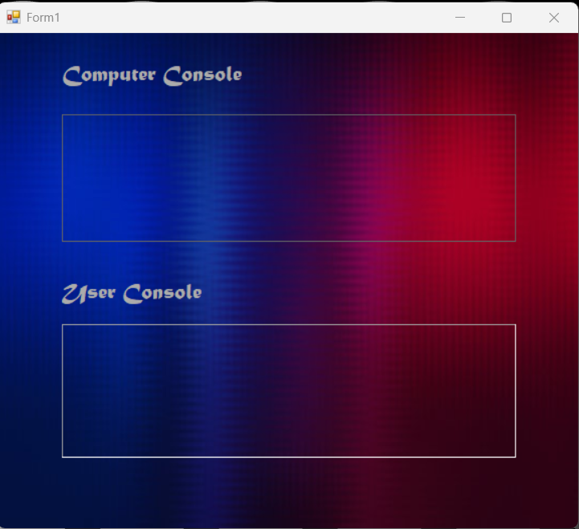
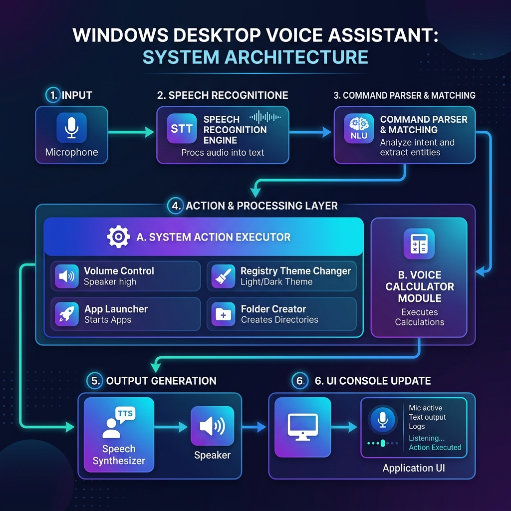
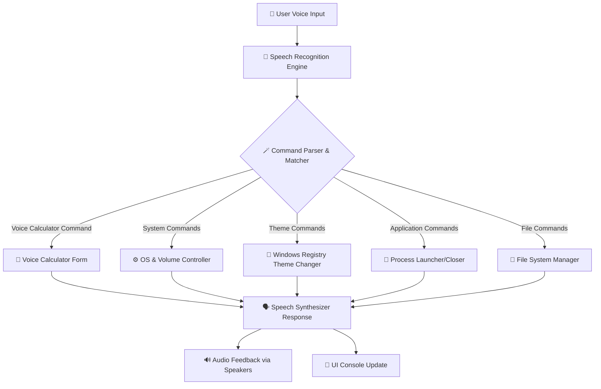

# 🎙️ Windows Voice Assistant (Desktop Console)

A sleek, lightweight, and offline-capable **Voice Assistant** built in C# using Windows Forms, leveraging the native `System.Speech` library for text-to-speech (TTS) and speech recognition. It allows users to control system volume, toggle system-wide dark/light themes via registry values, manage files, open/close common Windows apps, and use a dedicated hands-free **Voice Calculator** with vocal confirmations.

---

## 📸 Interface Preview



---

## ✨ Features

*   **🗣️ Speech Recognition & Synthesis:** Fully offline, local speech processing using `System.Speech.Recognition` and `System.Speech.Synthesis`.
*   **💻 System Commands:** Lock workstation, check time, current date, and perform volume controls (up/down).
*   **🎨 PC Theme Control:** Toggle system-wide Windows Immersive Dark Mode and Light Mode dynamically using registry hooks and DWM (Desktop Window Manager) updates.
*   **🧮 Voice Calculator Subsystem:** Activating with `"voicecal"` launches a standalone hands-free math utility, allowing verbal equations (e.g., `"10 plus 15"`, `"50 times 3"`) and vocalizing the answers.
*   **📁 File System Operations:** Voice commands to programmatically create or delete specific operational directories on the `D:` drive (`D:\Check\Folder`).
*   **🚀 App Launcher & Controller:** Launch and close native and third-party desktop applications (Notepad, Calculator, Paint, Word, Excel, Chrome, Firefox, Windows Camera, Settings panel).

---

## 🧩 System Architecture

The following diagram illustrates the flow of voice input processing, decision matching, and system response/action execution within the Voice Assistant:



### System Flow


---

## 🗣️ Voice Command Reference

Speak the following phrases clearly into your microphone to control the console:

### 1. General & System Controls
| Voice Command | Action Description | Assistant Response |
| :--- | :--- | :--- |
| `"hello"` | Greetings | *"Hello! How Can I help you?"* |
| `"time"` | Reads current system time | *"10:30 AM"* (Current time) |
| `"day"` | Reads current weekday and date | *"Today is Friday, June 12"* |
| `"lock"` | Locks your Windows workstation | *"Locking your computer"* |
| `"volume up"` | Simulates system volume-up keypresses | *"Volume increased"* |
| `"volume down"` | Simulates system volume-down keypresses | *"Volume decreased"* |
| `"exit"` | Closes the application | (Exits app) |

### 2. Desktop Application Management
| Voice Command | Action Description | Supported Applications |
| :--- | :--- | :--- |
| `"open <app>"` | Launches the application | `notepad`, `calculator`, `paint`, `winword` (Word), `excel`, `chrome`, `firefox`, `camera`, `settings`, `control` (Control Panel) |
| `"close <app>"` | Terminates running process safely | Same as above |

### 3. PC Theme Toggle
| Voice Command | Action Description |
| :--- | :--- |
| `"pc dark"` / `"dark"` | Switches Windows App/System settings to Dark Theme |
| `"pc light"` / `"light"` | Switches Windows App/System settings to Light Theme |

### 4. File Management
| Voice Command | Action Description | Target Path |
| :--- | :--- | :--- |
| `"create"` | Creates folder structure | `D:\Check\Folder` |
| `"delete"` | Safely deletes the empty folder | `D:\Check\Folder` |

### 5. Hands-Free Voice Calculator
Activate by saying `"voicecal"`. The main app window hides, and the custom Calculator form opens.
*   **Synthesized Cue:** *"Voice calculator ready. Please say your calculation."*
*   **Format:** `"[Number] [Operation] [Number]"` (Supports numbers `0` to `100`).
*   **Supported Operations:**
    *   `"plus"` (Addition)
    *   `"minus"` (Subtraction)
    *   `"times"` (Multiplication)
    *   `"divide"` (Division)
*   **Examples:**
    *   `"12 plus 45"` ➡️ *"Answer is 57"*
    *   `"10 times 8"` ➡️ *"Answer is 80"*
*   To exit calculator and return to main panel, say: `"close"` or `"exit"`.

---

## 🧑‍💻 Key Methods Overview

| Method | Description |
| :--- | :--- |
| `recognizer_SpeechRecognized()` | Handles all recognized voice commands |
| `SetSystemDarkMode()` | Enables or disables dark mode |
| `OpenApp()` / `CloseApp()` | Opens or closes applications |
| `CreateFolderInDDrive()` / `DeleteFolderFromDDrive()` | Folder management in D: |
| `ToggleSpeechRecognition()` | Enables or disables the speech engine |
| `GetGreeting()` | Time-based greetings (morning, afternoon, etc.) |

---

## 📁 Project Folder Structure

```text
voice-assistant/
├── .gitignore                   # Standard Visual Studio gitignore
├── voice asistant.sln           # Visual Studio Solution file
│
├── voice asistant/              # Main Source Project
│   ├── App.config               # App configurations (.NET runtime settings)
│   ├── voice asistant.csproj    # MSBuild Project specification
│   ├── Program.cs               # App entrypoint
│   ├── Form1.cs                 # Main GUI & voice parsing loop
│   ├── Form1.Designer.cs        # Main designer code
│   ├── Form1.resx               # Main form resources
│   ├── calculator.cs            # Voice Calculator subsystem Form
│   ├── calculator.Designer.cs   # Calculator designer code
│   ├── calculator.resx          # Calculator form resources
│   └── Properties/              # Assembly and resource properties
│
├── Voice-Assistant-App/         # Setup and Deployment Project folder
│   └── Voice-Assistant-App.vdproj
│
└── assets/                      # Shared media assets
    ├── screenshot.png           # Console User Interface mockup
    └── architecture-diagram.png # Generated architecture diagram
```

---

## 🧰 Requirements

| Component | Version / Details |
| :--- | :--- |
| **OS** | Windows 10 or 11 |
| **.NET Framework** | 4.7.2 or higher |
| **IDE** | Visual Studio 2019 / 2022 |
| **Libraries** | `System.Speech`, `System.Drawing`, `Microsoft.Win32`, `System.Runtime.InteropServices`, `System.Diagnostics` |
| **Hardware** | Microphone (for speech input) |

---

## 🚀 Installation & Setup

### For Users (Installing from Releases)

The voice assistant is packaged as a portable executable or a compressed installer:

1.  Navigate to the [Releases v1.0.0](https://github.com/PTharanan/voice-asistant/releases/tag/v1.0.0) page on the GitHub repository.
2.  Download the **[Voice.Assistant.zip](https://github.com/PTharanan/voice-asistant/releases/download/v1.0.0/Voice.Assistant.zip)**.
3.  Extract the `.zip` archive to any directory on your computer.
4.  Double-click **`voice asistant.exe`** to run the app instantly. No configuration is required!

> [!NOTE]
> Make sure your microphone is connected and configured as the default recording device in Windows Sound settings before launching.

### For Developers (Building from Source)

1.  Clone this repository to your local machine:
    ```bash
    git clone https://github.com/PTharanan/voice-asistant.git
    ```
2.  Open the solution file `voice asistant.sln` inside Visual Studio.
3.  Verify references to the native assemblies:
    *   `System.Speech` (Speech recognition engine)
    *   `System.Windows.Forms` (User Interface)
4.  Set the solution configuration to `Release` or `Debug`.
5.  Press `F5` or click **Start** in Visual Studio to build and run the project.

---

## ⚠️ Troubleshooting

| Issue | Solution |
| :--- | :--- |
| Speech not recognized | Check microphone input; set as default device |
| Theme not changing | Run Visual Studio as **Administrator** |
| App not opening | Ensure the app (e.g., Chrome, Word) is installed |
| “Access denied” during folder creation | Grant **write permission** to D: drive |

---

## 🧠 Future Enhancements

*   🌐 Add internet-based commands (weather, news, search)
*   🗓️ Calendar and reminder integration
*   🪄 Custom user-defined commands
*   🎵 Music and media control
*   🧠 LLM integration for advanced conversational mode

---

## 🪪 License

This project is licensed under the **MIT License** — feel free to modify, distribute, and use it in your own projects.

---

## 🧑‍💻 Author

**Perinpamoorthy Tharanan**  
💬 Developer • Voice UI Enthusiast • C# Automation Engineer  
📧 *ptharanan@gmail.com*  
🌐 [GitHub Profile](https://github.com/PTharanan)
